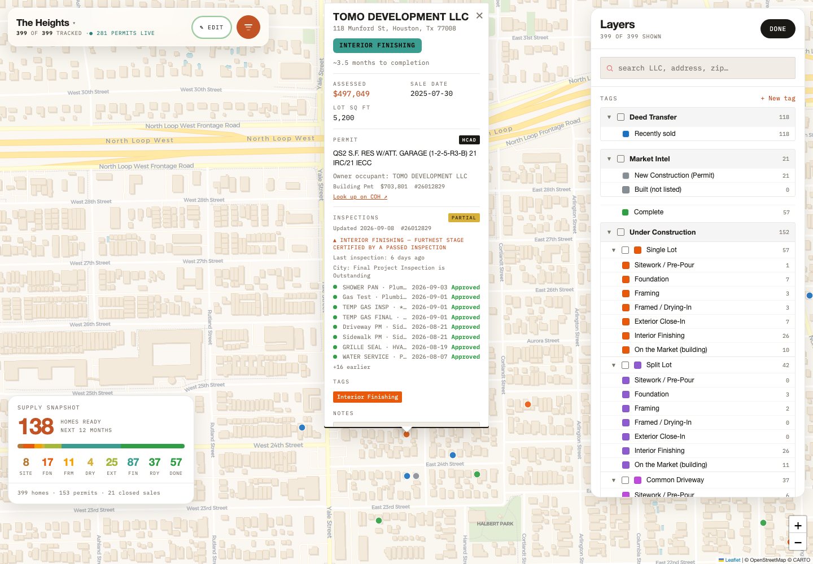

# Calibration Round 2 — 2026-09-08

Shipped to origin main: scraper `f1a2f79`, G1–G4 `4456299`, inspection refresh `eaa5055`. G6 is approved for release: the user updated 832 E 27th to Framing on its full FDN approval and replaced the historical prohibition with a durable synthetic WATER SERVICE-only guard.

## Phase 0: source audit and scraper correction

| Item | Finding / executed evidence |
|---|---|
| D0a | Discovery uses `permit_pull.py` / COH soldpermits. `scrape_inspections.py` uses `https://www.pdinet.pd.houstontx.gov/Inspection_Status/` and enters each project number. |
| D0b | Before: `normalize_result("Partial Approval", True)` returned `Passed`; raw was stripped before saving. DATA-line `Partial` matches: 0 (inspection rows are external JSON). After: live Munford returned exactly five raw partials. |
| D0c | Before: Building / Plumbing fixture parsing flattened groups. After: `permit_type` persists the grid header on each row; three-roughs tests identify distinct trades. |
| D0d | Before: not captured. After: `final_project_inspection_outstanding` is saved; live Munford is `true`. |
| D0e | Clicked the actual Export to Excel button: `Inspection Status_ProjectNo 26012829.xlsx`, `data:application/vnd.openxmlformats-officedocument.spreadsheetml.sheet;base64,...`; `EXPORT REQUESTS []`. ZIP/XML parsing found 60 shared strings, including Approved, Partial Approval and trade headers. The workbook omits the outstanding banner. Client-side structured XLSX, no separate endpoint. |

Actual request-building code:
```python
ILMS_URL = "https://www.pdinet.pd.houstontx.gov/Inspection_Status/"
page.goto(ILMS_URL, wait_until="networkidle", timeout=60000)
```

The former `if "approv" in s` ran before the disapproval test. Executing it returned `Disapproved → Passed`. Failure matching now runs first; only Approved / Partial Approval certify a pass. Unknown statuses become Pending instead of defaulting to Passed. `raw` is retained through serialization. The parser and output-construction driver are exercised by `python -B -m unittest discover -s tests`: `Ran 2 tests ... OK`.

Live Munford (#26012829): Partial Approval on `ROUGH IN` (Plumbing Pmt), `1035-Frame`, `Nail Pattern`, `1031-FDN PM`, and `INSULATION`; outstanding-final flag true.

All 844 saved/configured projects were refreshed with no missing prior project keys: 19,314 inspection rows, 1,112 raw partials. No refreshed row is Disapproved: **0 existing current rows corrected specifically by the disapproval substring fix**. Historical raw values were discarded, so this cannot establish how often it happened historically.

| Market | Projects | Rows | Partials | Matched existing status changes |
|---|---:|---:|---:|---:|
| heights | 281 | 6018 | 507 | 93 |
| montrose | 143 | 2735 | 159 | 37 |
| westu | 30 | 585 | 38 | 7 |
| riveroaks | 36 | 692 | 46 | 9 |
| springbranch | 162 | 3427 | 226 | 43 |
| timbergrove | 31 | 629 | 61 | 11 |
| gardenoaksoakforest | 161 | 5228 | 75 | 50 |

Status comparison matches type/date within each project. Of 250 matched changes, 196 are Passed → Pending, 33 Pending → Passed, 16 Pending → Failed, 3 Failed → Pending and 2 Passed → Failed. The comparison mixes parser changes and new city decisions; it is not a count of Disapproved defects. The conservative fallback accounts for canceled/revoked, held, untranslated and re-inspection-required rows no longer certifying a pass. Detailed rows are in `evidence.json`.

## Mapping and display changes

- Struct Final already mapped to market. G1–G4 preserves a dedicated Complete state downstream instead of returning recent structural completions to finishing; no duplicate Struct Final rule was added.
- FORM / FRM and MAKEUP FOUNDATION / FDN → Foundation; Brick Tie(s) and TCI → no promotion; 1035-Frame / city FRAME and roughs → Interior Finishing.
- Completed annotations show the structural final date. G6 additionally hides restamped inspection dates from table display and sorting while retaining raw feed dates.
- ETA priority: structural final → Complete/no ETA; insulation +5 calendar months; windstorm +6.5 months; ground-in +8 months; otherwise existing bucket default. Half-month display rounding; overdue is explicit and not available-now supply.
- Frame approval or three distinct passed rough trades without insulation adds insulation imminent.
- G6: site/utility/precon work → Sitework; ground-in or partial FDN → Foundation; raw Approved FDN (or FDN-WOOD/INSUL) → Framing; Windstorm → Framed / Drying-In; Nail Pattern / Fire Wall → Exterior Close-In; roughs/frame/insulation → Interior Finishing.
- Generic trade COVER and unrecognized electrical/plumbing names no longer certify the windstorm bucket. Full G6 depends on actual raw approval; legacy FDN rows without raw remain Foundation.
- G6 removes the 18-month date cutoff so later lower-stage passes cannot erase older higher-stage evidence. Passed max-rank aggregation remains monotonic; corrections of formerly false passes are an evidence correction, not time-based regression.
- All eight hand-authored HTML DATA lines remain byte-identical. RECONCILE marker contents remain untouched. Single Lot, Split Lot, and Common Driveway grouping logic remains intact. Spring Valley keeps its six rendered static listings; its missing permit input and empty feed were not regenerated.

Inspection vocabulary audit: every observed FINAL-containing type already matched a rule. Additional ambiguous variants `ADMIN.FINAL`, `AT-FINAL`, `CELL >60 FINAL`, `DECO AE FINAL`, `DECO AF FINAL` remain at their existing market mapping; they are not treated as structural completion.

## Fixture scoring

The user confirmed the historical 22-property list has no file and authorized reconstruction from the named Phase 2 properties and retained assertions. `fixtures.json` contains 12 unit/property assertions, including separate Waverly A/B/C and Voight 1033/1035 checks. This is not a claimed 20/22 reproduction. Merged pins resolve to their rendered project and individual permit evidence is checked too.

Executed `tests/browser_calibration.py --html-ref 4456299 --expect-old --output /tmp/heights-round2/pass1-refreshed.json`: **12/12**, `page errors: []`. The live site also scored **12/12**.

Executed `tests/browser_calibration.py --all-markets --output /tmp/heights-round2/g6-approved.json`: **83/83 taxonomy cases on each of 8 pages**, source fixtures **12/12**, `page errors: []`. All eight markets use the unchanged, previously verified G6 implementation.

| Property | Old expected | G6 expected | G6 actual | Result |
|---|---|---|---|---|
| 112 E 27th | Complete | Complete | Complete | PASS |
| 609 E 25th | Complete | Complete | Complete | PASS |
| 118 Munford | Interior Finishing | Interior Finishing | Interior Finishing | PASS |
| 711 E 25th A | Interior Finishing | Interior Finishing | Interior Finishing | PASS |
| 1033 Voight | Interior Finishing | Interior Finishing | Interior Finishing | PASS |
| 1035 Voight | Interior Finishing | Interior Finishing | Interior Finishing | PASS |
| 830 E 26th | NOT Sitework / Pre-Pour, Foundation, Framing, Framed / Drying-In, Exterior Close-In, Interior Finishing, Market, Complete | NOT Sitework / Pre-Pour, Foundation, Framing, Framed / Drying-In, Exterior Close-In, Interior Finishing, Market, Complete | No stage | PASS |
| 710 Waverly A | NOT Interior Finishing, Market, Complete | NOT Interior Finishing, Market, Complete | Foundation | PASS |
| 710 Waverly B | NOT Interior Finishing, Market, Complete | NOT Interior Finishing, Market, Complete | Foundation | PASS |
| 710 Waverly C | NOT Interior Finishing, Market, Complete | NOT Interior Finishing, Market, Complete | Foundation | PASS |
| 832 E 27th | NOT Framing | Framing (user-approved full FDN evidence) | Framing | PASS |
| 835 Lawrence | NOT Interior Finishing, Market, Complete | NOT Interior Finishing, Market, Complete | Foundation | PASS |

**832 E 27th (#26027027):** refreshed COH evidence is `1031-FDN PM`, `Building Pmt`, `Approved`, `2026-08-28`. The user approved Framing under full G6: the September 1 street audit saw foundation four days after pour, and the historical prohibition targeted WATER SERVICE rather than full FDN approval. The replacement synthetic fixture in `fixtures.json` contains only an Approved Building Pmt / WATER SERVICE inspection and asserts both NOT Framing and Sitework. It is independent of 832’s evolving real data. There are no supplied street-audit siding descriptions from which to invent additional remaps; exterior coverage uses explicit inspection fixtures.

## Mutation results

Executed the same browser harness with `--mutant completion`, `--mutant eta`, and `--mutant exterior`. All mutations were caught by their targeted assertions. A fourth mutation, `--mutant water-service`, restores WATER SERVICE → Framing: property fixtures still pass 12/12, while the taxonomy suite drops to 80/83 and both new synthetic assertions fail, alongside the existing WATER SERVICE case.

| Mutant | Targeted observed failures | Taxonomy score |
|---|---|---|
| completion | 112 E 27th and 609 E 25th both lose Complete | 77/81 |
| eta | 118 Munford and 711 E 25th lose insulation anchor/target | 72/81 |
| exterior | Nail Pattern and FIRE WALL both lose Exterior Close-In | 79/81 |

The completion mutant restores the actual downstream regression; mutating a nonexistent missing Struct Final rule would test the wrong defect.

## ETA sanity sample

Deterministic random sample of ten current under-construction pins (seed 20260908), evaluated as of September 8. Old values invoke the original committed function on the same pin IDs; G6 estimates invoke the changed functions.

| Property | Old months | New estimate | Anchor | Target |
|---|---:|---|---|---|
| 1306 W 24th St C, Houston, TX 77008 | 4 | 6.5 months | WINDSTORM | 2027-03-23 |
| 1926 Northwood St, Houston, TX 77009 | 4 | 4.5 months | WINDSTORM | 2027-01-22 |
| 1914 Northwood St, Houston, TX 77009 | 4 | 4.5 months | WINDSTORM | 2027-01-28 |
| 1008 E 28th St, Houston, TX 77009 | 4 | 6 months | WINDSTORM | 2027-03-14 |
| 915 W 18th St B, Houston, TX 77008 | 2 | overdue vs typical pace | WINDSTORM | 2026-07-30 |
| 2924 Watson Street | 0 | 4 months | INSULATION | 2027-01-11 |
| 602 Northwood St, Houston, TX 77009 | 2 | 0.5 months | INSULATION | 2026-09-14 |
| 318 W 21st Street | 0 | 3 months | INSULATION | 2026-12-15 |
| 920 E 25TH Street | 0 | 2 months | INSULATION | 2026-11-02 |
| 705 E 13th St, Houston, TX 77008 | 8 | 4.5 months | GROUND IN | 2027-01-29 |

Source sanity: Munford insulation July 28 → December 28, 2026 (~3.5 months remaining). 711 insulation August 17 → January 17, 2027 (~4.5 months), **46 days after** the builder’s December 2 plan, as authorized. Completed source fixtures show no ETA.

## All-market stage counts

Each cell is original → G6. Counts are rendered map records after pairing/exclusions, not unit-weighted homes. Unit-weighted `phaseBreakdown`, `ucCount`, and deed counts are retained in `evidence.json`; product grouping was not changed. This table includes inspection refresh effects and taxonomy changes.

| Market | Sitework | Foundation | Framing | Framed / Drying-In | Exterior | Interior | Market | Complete | No stage |
|---|---:|---:|---:|---:|---:|---:|---:|---:|---:|
| gardenoaksoakforest.html | 0 → 0 | 5 → 2 | 0 → 3 | 2 → 0 | 0 → 0 | 10 → 10 | 45 → 38 | 0 → 52 | 90 → 47 |
| index.html | 0 → 8 | 33 → 15 | 0 → 10 | 35 → 4 | 0 → 25 | 73 → 69 | 54 → 26 | 0 → 43 | 160 → 155 |
| montrose.html | 0 → 1 | 28 → 18 | 0 → 11 | 10 → 1 | 0 → 6 | 35 → 33 | 35 → 26 | 0 → 15 | 92 → 89 |
| riveroaks.html | 0 → 0 | 1 → 1 | 0 → 0 | 5 → 1 | 0 → 3 | 3 → 4 | 5 → 5 | 0 → 0 | 26 → 26 |
| springbranch.html | 0 → 0 | 21 → 17 | 1 → 5 | 19 → 1 | 0 → 13 | 84 → 65 | 73 → 53 | 0 → 47 | 218 → 215 |
| springvalley.html | 0 → 0 | 0 → 0 | 0 → 0 | 0 → 0 | 0 → 0 | 0 → 0 | 6 → 6 | 0 → 0 | 0 → 0 |
| timbergrove.html | 0 → 1 | 7 → 1 | 0 → 3 | 4 → 3 | 0 → 1 | 19 → 12 | 7 → 7 | 0 → 10 | 1 → 0 |
| westu.html | 0 → 0 | 5 → 3 | 0 → 3 | 8 → 0 | 0 → 4 | 11 → 11 | 9 → 9 | 0 → 4 | 64 → 63 |

G6 Heights Framing is populated: **10 rendered pins / 11 unit-weighted homes**. Sitework: 8 pins. Exterior Close-In: 25 pins. The final unit-weighted stage counts from the approved release check are below.


| Market | Sitework | Foundation | Framing | Framed / Drying-In | Exterior Close-In | Interior Finishing | Market | Complete |
|---|---:|---:|---:|---:|---:|---:|---:|---:|
| Heights | 8 | 17 | 11 | 4 | 25 | 87 | 31 | 57 |
| Montrose | 2 | 19 | 14 | 1 | 6 | 37 | 37 | 21 |
| River Oaks | 0 | 1 | 0 | 1 | 3 | 4 | 5 | 0 |
| Spring Branch | 0 | 17 | 5 | 1 | 13 | 66 | 56 | 47 |
| Spring Valley Village | 0 | 0 | 0 | 0 | 0 | 0 | 6 | 0 |
| Timbergrove / Lazybrook | 1 | 1 | 3 | 3 | 1 | 12 | 7 | 10 |
| West University | 0 | 4 | 3 | 0 | 4 | 11 | 9 | 6 |
| Garden Oaks / Oak Forest | 0 | 2 | 3 | 0 | 0 | 10 | 38 | 52 |
| **Total** | 11 | 61 | 39 | 10 | 52 | 227 | 189 | 193 |

These are unit-weighted homes, matching the map’s stage counts; a paired pin can represent more than one home. Stage counts include listed homes still building. Complete is excluded from under-construction supply.

## G5 — skipped as instructed

`sold_ingest.py` supports Heights only and expects these files relative to the repository working directory:

- `/Users/nemoclaw/jarvis/heights-map/HAR_Export_2025_heights.csv` (new-construction cohort)
- `/Users/nemoclaw/jarvis/heights-map/HAR_Export_2024-heights.csv` (resale cohort)

Both are absent. The script writes `sold_emit.txt`; it does not splice HTML and does not refresh deeds. No sales source was improvised. Sales/deed rows updated: **0**. Deed transfers remain **118 → 118**.

Executed `/Users/nemoclaw/insp-venv/bin/python -B sold_staleness.py`:
```text
⚠ HAR sold-comps pull due: heights (2026-08-12), montrose (2026-06-18), westu (none), riveroaks (2026-05-11), springbranch (2026-07-12), timbergrove (2026-05-04), gardenoaksoakforest (2026-07-31) — newest sale per market in (), threshold 21d
```

## Shipping and open items

`git push origin main` returned `768a1d8..eaa5055 main -> main`. Live source fixtures returned `12 / 12`, `page errors: []`. Netlify rewrites navigation links, so whole-response HTML hashes differ from Git; inline-script equivalence was verified for all eight pages: `live inline script match: True` for every market, including the hand-authored DATA blocks. No direct Netlify deployment API was used.

- Ambiguous final variants remain unverified and unchanged.
- Historical mis-normalized statuses cannot be reconstructed from old feeds lacking raw fields; the current fresh audit found no Disapproved rows.
- `No Action Required` remains the pre-existing Failed normalization; its city semantics need separate verification before changing it.
- Wire up a separate deed source and provide the missing HAR CSVs for a future G5 run.
- Spring Valley has no permit input; its inspection refresh remains intentionally disabled.


